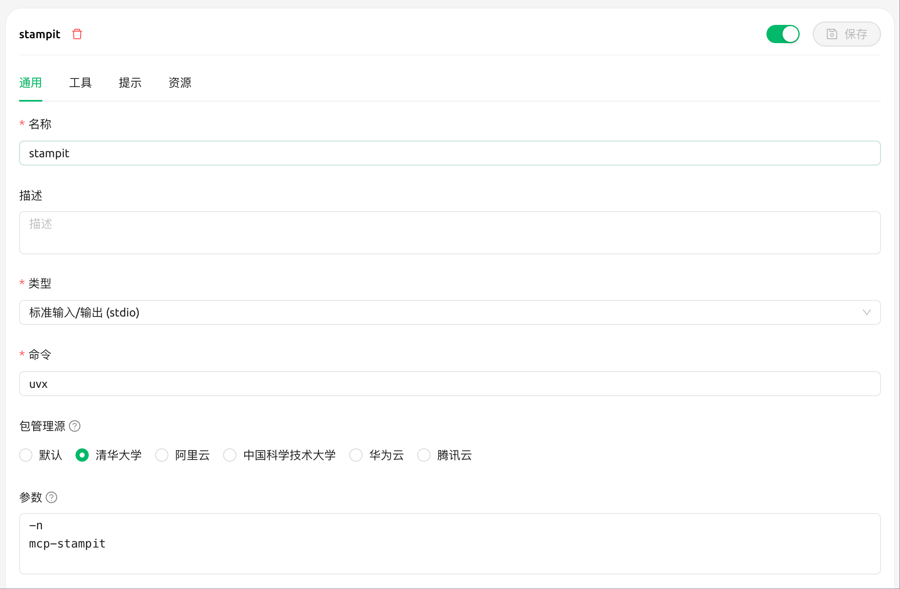
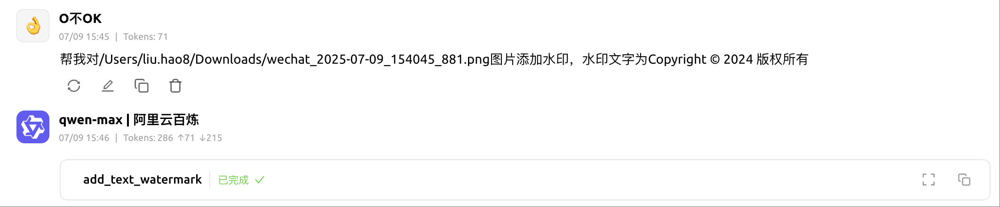
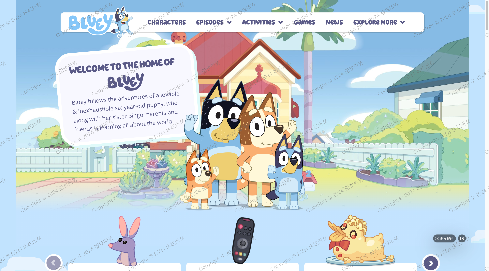
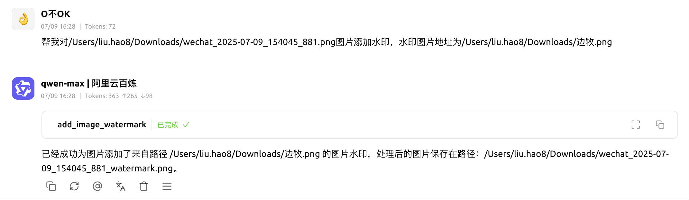

# 🎯 Stamp it - 为图片添加满屏水印

一个基于 FastMCP 的专业图片水印服务，支持文字水印和图片水印，具备智能颜色适配功能。

## ✨ 主要特性

- 🖼️ **双水印模式**: 支持文字水印和图片水印
- 📂 **本地文件处理**: 专业的本地图片文件处理
- 🎨 **智能自适应颜色**: 根据图片亮度自动选择最佳水印颜色
- 📐 **倾斜水印效果**: 可自定义角度的倾斜水印（默认30度右上倾斜）
- 🌍 **多语言支持**: 中文、英文、日文、韩文等多种语言
- 🎯 **高密度覆盖**: 完整覆盖图片的每个角落，无遗漏
- 💎 **高清晰度**: BICUBIC重采样技术，边缘平滑
- 📁 **智能保存**: 自动保存在原图同目录，保持文件组织
- ⚡ **性能优化**: 字体缓存、智能缩放、内存管理
- 🛠️ **格式丰富**: 支持7种常见图片格式

## 📖 使用方法

### MCP 客户端配置

#### Cherry Studio (推荐)

1. **打开 Cherry Studio 设置**
   - 进入 设置 → MCP 服务器
   - 点击 "添加服务器"

2. **配置 MCP 服务器**
   
   

3. **保存并连接**
   - 点击 "保存" 添加服务器
   - 服务器将自动连接
   - 现在可以在 Cherry Studio 中使用水印工具
   
   

#### Cursor

1. **打开 Cursor 设置**
   - 使用快捷键 `Cmd+,` (Mac) 或 `Ctrl+,` (Windows/Linux)
   - 或者点击 设置 → 偏好设置

2. **配置 MCP 服务器**
   - 找到 "MCP 服务器" 配置选项
   - 添加以下配置：

```json
{
  "mcpServers": {
    "stampit": {
      "command": "uvx",
      "args": [
        "mcp-stampit"
      ]
    }
  }
}
```

3. **保存并重启**
   - 保存配置文件
   - 重启 Cursor 以生效
   - 现在可以在 Cursor 中使用水印工具

## 📦 预览








## 🚀 安装

### 使用 uv (推荐)

```bash
# 安装依赖
uv pip install fastmcp pillow

# 或使用项目配置安装
uv pip install -e .
```

### 使用 pip

```bash
pip install fastmcp pillow
```

### 启动 MCP 服务器 (独立运行)

```bash
python main.py
```

服务器启动后，你将看到类似以下的输出：
```
╭─ FastMCP 2.0 ─────────────────────────────────────────╮
│   🖥️  Server name:     Stamp it - 为图片添加满屏水印'    │
│   📦 Transport:       STDIO                           │
╰───────────────────────────────────────────────────────╯
```

### 可用的 MCP 工具

#### `add_text_watermark` - 文字水印

为图片添加智能文字水印，支持多语言和自适应颜色。

**参数:**
- `image_path` (str): 本地图片文件路径
- `watermark_text` (str): 水印文字内容
- `angle` (float, 可选): 水印倾斜角度，默认30度

**使用示例:**
```python
# 基础文字水印
add_text_watermark("/Users/photos/vacation.jpg", "我的版权")

# 自定义角度
add_text_watermark("./document.png", "机密文件", angle=45)

# 多语言水印
add_text_watermark("photo.jpg", "Copyright © 2024 版权所有")
```

#### `add_image_watermark` - 图片水印

为图片添加图片水印，支持logo、签名等图片作为水印。

**参数:**
- `image_path` (str): 本地图片文件路径
- `watermark_image_path` (str): 水印图片文件路径
- `angle` (float, 可选): 水印倾斜角度，默认30度

**使用示例:**
```python
# 添加logo水印
add_image_watermark("/Users/photos/product.jpg", "/Users/logos/company_logo.png")

# 自定义角度的logo水印
add_image_watermark("photo.jpg", "signature.png", angle=0)

# 品牌水印
add_image_watermark("marketing_image.jpg", "brand_watermark.png", angle=15)
```

## 🎨 水印特性详解

### 📝 文字水印特性

- **智能颜色自适应**
  - 亮色图片: 自动使用深色水印 (RGB 20,20,20)
  - 暗色图片: 自动使用浅色/白色水印 (RGB 240,240,240)
  - 中等亮度: 智能选择对比度最佳的颜色

- **多语言字体支持**
  - 自动检测并加载系统最佳中文字体
  - 支持 PingFang SC、微软雅黑、黑体等
  - 完美显示中文、日文、韩文、英文

- **高质量渲染**
  - 字体缓存技术，提升性能
  - BICUBIC重采样，边缘平滑
  - 居中渲染，旋转效果佳

### 🖼️ 图片水印特性

- **智能缩放**: 自动缩放到合适大小（默认15%）
- **透明度控制**: 自动调整透明度，不影响原图
- **保持比例**: 保持水印图片的宽高比
- **高质量缩放**: 使用LANCZOS算法，确保清晰度

### 🎯 布局算法

- **完整覆盖**: 从图片边界外开始，确保100%覆盖
- **错位排列**: 奇偶行错位，视觉效果更自然
- **密集分布**: 优化间距算法，密度比传统方法提升40%
- **边缘处理**: 四个角落都有完整的水印覆盖

## 📁 文件输出

### 保存规则
- **保存位置**: 自动保存在原图同一目录
- **命名规则**: 原文件名 + `_watermark` + 扩展名
- **格式保持**: 保持原图的文件格式和质量
- **优化保存**: 启用压缩优化，减小文件大小

### 输出示例
```
输入: /Users/photos/vacation.jpg
输出: /Users/photos/vacation_watermark.jpg

输入: ./designs/logo.png
输出: ./designs/logo_watermark.png

输入: document.pdf.png
输出: document.pdf_watermark.png
```

## 🛠️ 支持的图片格式

| 格式 | 扩展名 | 读取 | 保存 | 透明度 | 优化 |
|------|--------|------|------|--------|------|
| JPEG | .jpg, .jpeg | ✅ | ✅ | ❌ | ✅ |
| PNG | .png | ✅ | ✅ | ✅ | ✅ |
| GIF | .gif | ✅ | ✅ | ✅ | ✅ |
| BMP | .bmp | ✅ | ✅ | ❌ | ✅ |
| TIFF | .tiff, .tif | ✅ | ✅ | ✅ | ✅ |
| WebP | .webp | ✅ | ✅ | ✅ | ✅ |

## 🌍 多语言字体支持

### 支持的语言
- **中文**: 简体中文、繁体中文
- **日文**: ひらがな、カタカナ、漢字
- **韩文**: 한글 (韩文字母)
- **英文**: Latin 字符集
- **其他**: 大部分 Unicode 字符

### 字体优先级

**macOS 系统:**
1. PingFang SC (苹果默认中文字体)
2. STHeiti Light (华文黑体)
3. Hiragino Sans GB (冬青黑体)
4. Arial Unicode (通用Unicode字体)

**Windows 系统:**
1. Microsoft YaHei (微软雅黑)
2. SimSun (宋体)
3. SimHei (黑体)

**Linux 系统:**
1. DejaVu Sans
2. Liberation Sans
3. Noto Sans CJK
4. WenQuanYi Zen Hei

## 📂 项目结构

```
stampit/
├── main.py                   # 主程序和MCP服务器
├── pyproject.toml            # 项目配置文件
├── README.md                 # 英文项目文档
├── README_CN.md              # 中文项目文档
├── uv.lock                   # 依赖锁定文件
└── LICENSE                   # 许可证文件
```

## 🧪 快速测试

### 测试文字水印
```bash
# 1. 启动服务器
python main.py

# 2. 在MCP客户端中调用
add_text_watermark("path/to/your/image.jpg", "测试水印")
```

### 测试图片水印
```bash
# 1. 准备一个logo图片
# 2. 在MCP客户端中调用
add_image_watermark("path/to/your/photo.jpg", "path/to/logo.png")
```

## ⚙️ 技术细节

### 核心算法
- **亮度计算**: 灰度转换 + 像素平均值算法
- **颜色自适应**: 基于亮度阈值的四级分类系统
- **位置计算**: 错位网格 + 边缘偏移算法
- **渲染优化**: BICUBIC/LANCZOS重采样技术

### 性能优化
- **字体缓存**: 避免重复加载字体文件
- **智能缩放**: 亮度计算使用50x50小图提升速度
- **内存管理**: 及时释放临时图层和缓存
- **批量处理**: 支持高效的批量图片处理

### 质量保证
- **边缘平滑**: 使用高质量重采样算法
- **颜色保真**: 保持原图色彩空间和模式
- **透明度处理**: 正确处理RGBA通道
- **格式兼容**: 智能转换不同图片格式

## 🔧 高级配置

可以通过修改 `WatermarkConfig` 类来调整参数：

```python
class WatermarkConfig:
    DEFAULT_FONT_SIZE = 36          # 默认字体大小
    DEFAULT_ANGLE = 30              # 默认倾斜角度
    SPACING_X_FACTOR = 1.1          # 水平间距倍数
    SPACING_Y_FACTOR = 0.9          # 垂直间距倍数
    BRIGHTNESS_THRESHOLDS = {       # 亮度阈值
        'very_bright': 180,
        'medium': 120,
        'dark': 60
    }
```

### 自定义参数建议
- **密集水印**: 降低间距倍数 (0.8, 0.7)
- **稀疏水印**: 提高间距倍数 (1.5, 1.3)
- **大字体**: 提高字体大小 (48, 54)
- **小字体**: 降低字体大小 (24, 30)

## 🎛️ 使用技巧

### 文字水印技巧
1. **版权信息**: 使用 "© 2024 Company Name" 格式
2. **多语言**: 混合中英文效果更佳
3. **角度选择**: 30度最自然，45度更醒目，0度适合文档

### 图片水印技巧
1. **Logo设计**: 使用透明背景的PNG格式
2. **尺寸控制**: Logo不宜过大，建议控制在原图15%以内
3. **颜色搭配**: 选择与原图对比度合适的Logo颜色

## 💡 最佳实践

### 批量处理建议
```python
# 推荐的批量处理方式
images = ["photo1.jpg", "photo2.jpg", "photo3.jpg"]
watermark_text = "© 2024 My Company"

for image_path in images:
    result = add_text_watermark(image_path, watermark_text)
    print(result)
```

### 性能优化建议
1. **同批次使用相同字体大小**，利用字体缓存
2. **避免频繁改变角度**，减少计算开销
3. **图片水印尽量使用小尺寸**，提升处理速度

## 📄 许可证

本项目遵循 Apache 2.0 许可证，详情请查看 LICENSE 文件。

## 🤝 贡献

欢迎提交 Issue 和 Pull Request！

### 贡献指南
1. Fork 项目
2. 创建功能分支
3. 提交更改
4. 发起 Pull Request

## 📞 技术支持

如有问题或建议，请：
1. 提交 GitHub Issue
2. 查看项目文档
3. 联系开发团队

---

**🎉 感谢使用 Stamp it！**